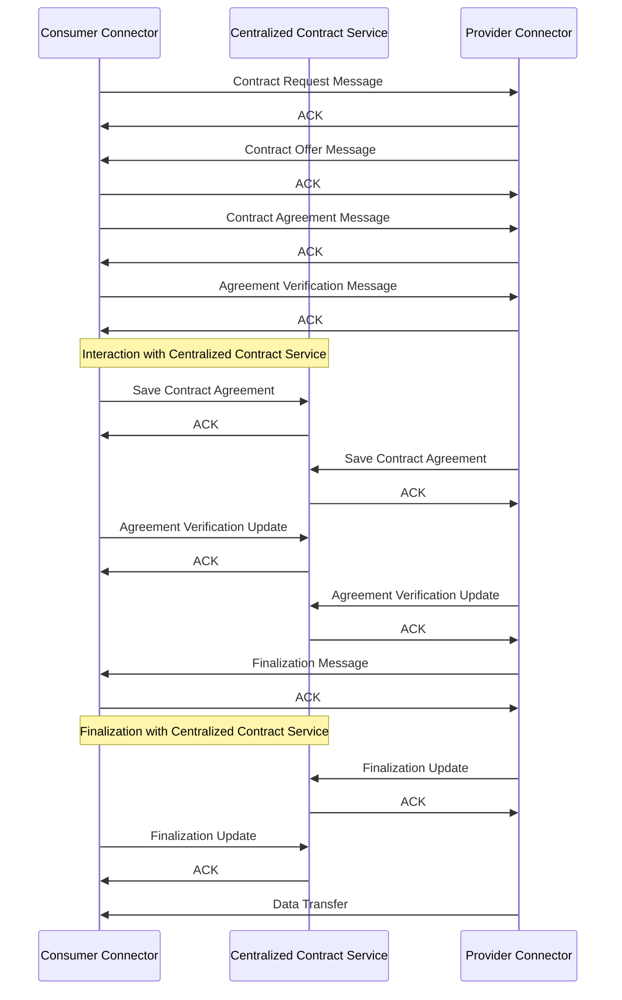

# Contract: Connector Requirements

In order for the Prometheus-X Dataspace Connector to align properly and be compliant with the IDS Dataspace Protocol and IDS-compliant connectors, there is a strong need to add a layer for contract management directly in the connector.

## Integration in the connector

Within the connector, the IDS Negotiation Protocol should be directly implemented in order to allow negotiation and contractualisation between 2 connectors for bilateral contracts.

**However**, in order to remain aligned with Prometheus-X protocols, it should have an extended implementation inside of which the connector would communicate with the centralized contract service to generate, save and sign the negotiated contract.

This is necessary as the contracts should still exist and persist in the centralized contract service in order to enforce and authorize Prometheus-X data transfer protocols.

> 🔎*This could be done through the [Mediator Protocol](./mediator-protocol.md) by automating communications with the centralized contract service*

## Protocol

> 🚧 This is a WIP protocol and proposition. It is **absolutely not** a final product. It is just a starting point for further brainstorming.

