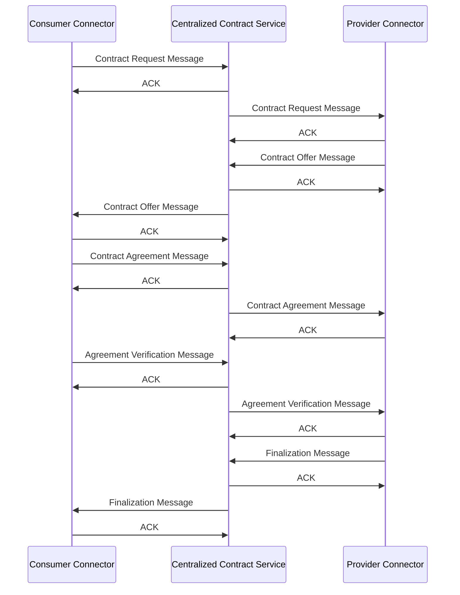

# Mediator Protocol

This protocol defines an implementation adapted to the PTX centralized contract management solution in order to support in some way the **IDS negotiation protocol** from the IDSA Dataspace Protocol.

## Advantages

### Storage
The IDS negotiation protocol does not assume any specific solution in order to store negotiation / contract objects. The centralized contract manager is aimed to work with a persistent layer (currently a Mongo Database) which would be ready directly to persist these objects and save the trouble from participants or connectors.

### Trusted third party monitoring
Having a centralized service that is trusted / certified in the dataspace enables to have the protocol interactions be logged and monitored by a trusted entity that is not directly tied to the participants. 

> *Participants could potentially be able to question the dataspace governance authority in place to request logs, audits and conflict resolutions.*

### Ecosystem contracts
Although the IDS dataspace protocol defines a protocol aimed towards bilateral negotiation only, having the adaptation using the centralized contract entity would enable to also expand on the protocol to support ecosystem contracts as well.

## Protocol

### 💡Idea 1: Proxy Between Connectors
In this first idea, the method of communication for connectors would not be any different than when communicating directly with another connector.

Each connector would send and receive the defined protocol messages to and from the centralized contract service.

